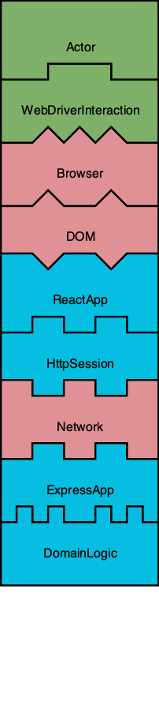
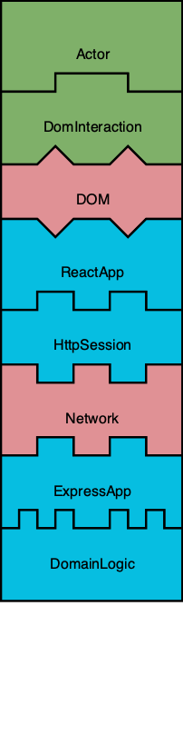
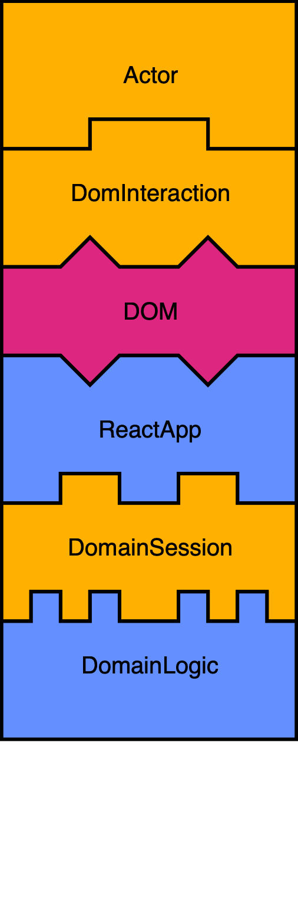
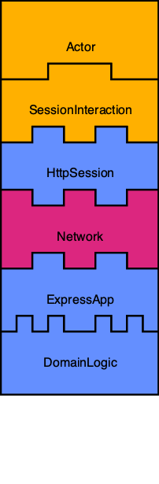

# Assembly Diagrams

An *Assembly Diagram* is a visualisation of a *Component Assembly*, and
a *Component Assembly* is a set of components that are connected (stacked) in a particular way.

Assembly Diagrams are useful for understanding and designing full-stack automated test suites
that can run in milliseconds:

Assembly Diagrams typically visualise three kinds of components:

*  Test components
*  Infrastructure components
*  Production components

You can think of each component as a "lego brick" with three characteristics:

* The top [studs](https://www.brothers-brick.com/lego-glossary/#Stud) of the brick represent the component's *contract* (the **interface** it implements)
* The brick itself is *how* the component fulfils the contract (its **implementation**)
* The bottom [anti-studs](https://www.brothers-brick.com/lego-glossary/#Anti-stud) is the contract the component *needs* (its **dependency**)

There can be multiple implementations of the same interface. This makes it possible to create a wide
range of *Component Assemblies*. If you've ever played with lego you know this.

| Full Stack                                   | DOM-HTTP-Domain                         | DOM-Domain                         | HTTP-Domain                         | Domain                              |
| ---------------------------------------------| --------------------------------------- | ---------------------------------- | ----------------------------------- | ----------------------------------- |
|  |  |  |  |  |

Each of these assemblies make tradeoffs between three important aspects of automated tests:

* Speed
* Confidence (how much is tested)
* Diagnostic precision (how easy it is to understand why a test fails)

The general idea is to have more of the fast tests and fewer of the slow ones -
as few as you can get away with.

The *Dom-Domain* assembly exercises most of the functional parts of the stack, yet they
typically run in a few milliseconds. This is because there is no I/O in the assembly.

These tests obviously don't provide any confidence about components that are not present.
The *Full Stack* assembly connects all the components similarly to the production environment.
Tests in this assembly can be run occasionally, for maximum confidence.

The extremely fast acceptance tests enable high productivity, as developers can
get near-instant feedback on their changes. The slower, really thorough
ones have a different purpose - to verify that everything works before a commit,
and for more thorough CI tests.

## Conventions

Components are grouped in the follow categories:

* test code - green
* infrastructure - pink
* production code  - light blue

This makes it easier to distinguish between different types of components.
It also makes it easier to quickly spot what's essential about an assembly:

* How fast is it? (less infrastructure means faster tests)
* How much confidence does it give? (less production code means less confidence)
* How easy is it to diagnose why a test failed? (less production code and infastructure means easier)
  (fast/slow, with/without infrastructure).

## Generate your own assembly diagrams

Write an assembly script by copying and modifying one of the scripts in the `assemblies` directory.
You also need Node.js installed. Then run:

    npx assembly-diagrams some-assembly.txt > some-assembly.svg

For more information:

    npx assembly-diagrams --help

### Build PNGs from SVGs

If you need to convert the SVG file to a PNG file, you can use [cairosvg](https://cairosvg.org/).

    brew install python3
    pip3 install cairosvg lxml tinycss cssselect
    cairosvg --scale 0.4 assembly.svg -o assembly.png

The `Makefile` contains an example of how to automate generation of SVG and PNG files

## Release process

    npm version major|minor|patch
    npm publish
    git push && git push --tags
