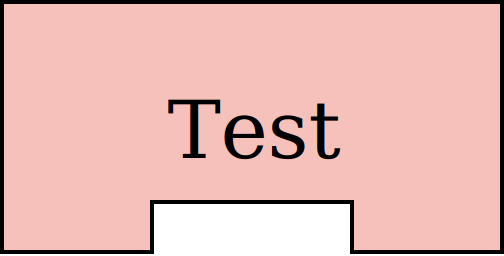
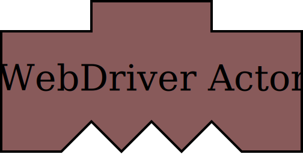
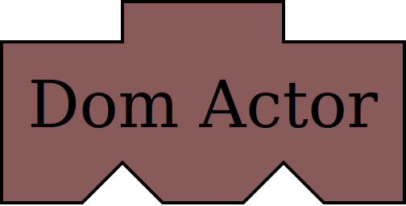
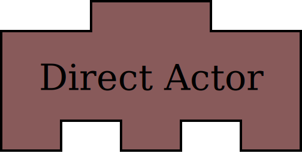
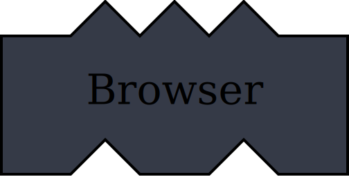
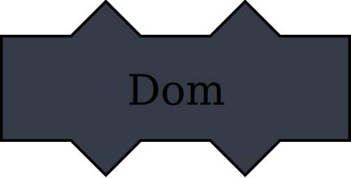
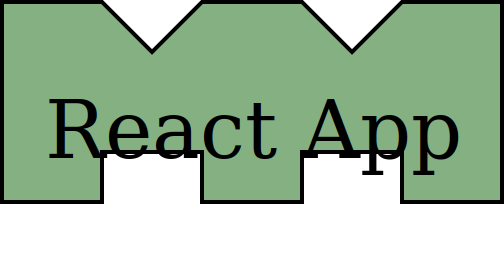
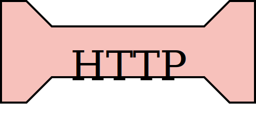
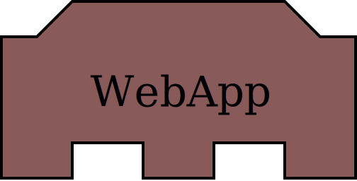

# Full-Stack Diagrams

A Full-Stack Diagram visualises how a test suite (as well as the system under test) 
is assembled. When a test suite and the system under test defines clear contracts
between components, different assemblies can be constructed:

| `------Full Stack------`                     | `------DOM-Domain------`              | `--------Domain--------`              | `-----HTTP-Domain------`              |
| -------------------------------------------- | ------------------------------------- | ------------------------------------- | --------------------------------------|
|                         |                  |                  |                  |
|   |        |          |          |
|                   |                    |  |    |
|                           |        |                                       |                  |
|               |  |                                       |              |
|           |                                       |                                       |  | 
|                         |                                       |                                       |                                       |
|                     |                                       |                                       |                                       |
|         |                                       |                                       |                                       |

(There are more possibilities, such as `DOM-HTTP-Domain`)

These different assemblies make tradeoffs between test *speed* and test *confidence*.

The idea is to have more of the fast tests and fewer of the slow ones -
as few as you can get away with.

The *Dom-Domain* tests exercise most of the functional parts of the stack, yet they 
typically run in a few milliseconds. This is because there is no I/O in the assembly. 
CPU-heavy components (such as a visual browser) are not present.

These tests obviously don't provide any confidence about components that are not present. 
The *Full Stack* assembly connects all the components in a similar way to the production environment.
Tests in this assembly can be run occasionally, for maximum confidence.

The extremely fast acceptance tests enable high productivity, as developers can
get near-instant feedback on their changes. The slower, really thorough
ones have a different purpose - to verify that everything works before a commit,
and for more thorough CI tests.

## Edit and build your own SVGs

The pieces are defined in `pieces.txt`. It consists of multiple pieces like this:

```
‾‾╲╱‾‾╲╱‾‾
 React App
__‾‾__‾‾__
path { fill: rgba(132, 176, 130, 1); }
text { font: 60px serif; fill: #000000; }
```

You can fork this repo, edit `pieces.txt` and rebuild the `./svg/*.svg` files:

    yarn build

## Conventions

Components are grouped in the follow categories:

* test - green
* infrastructure - pink
* frontend - orange
* backend - light blue

This makes it easier to distinguish between different types of components.
It also makes it easier to quickly spot what's essential about an assembly
(fast/slow, with/without infrastructure).
